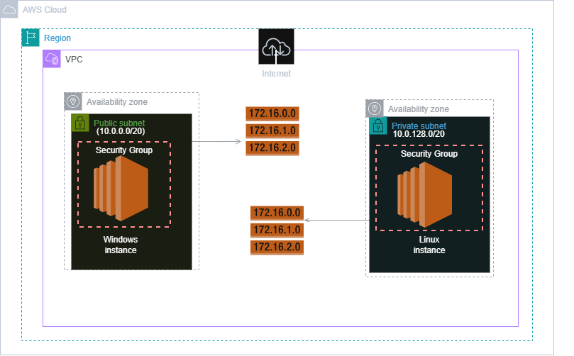
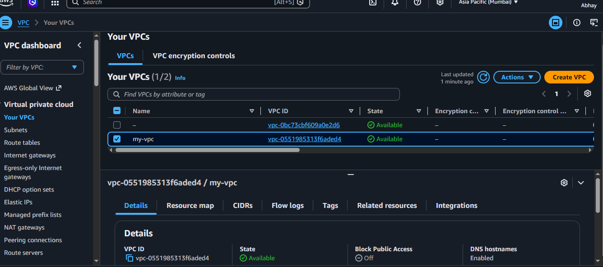
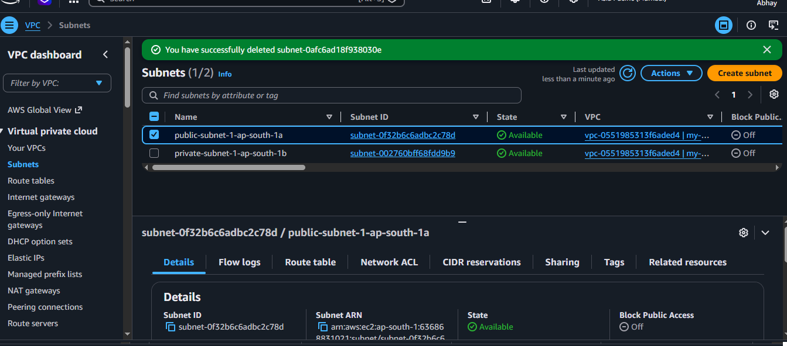
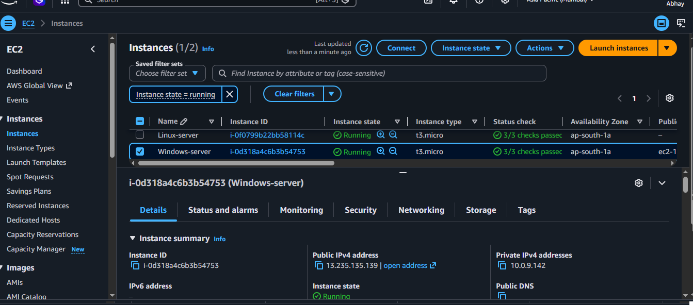
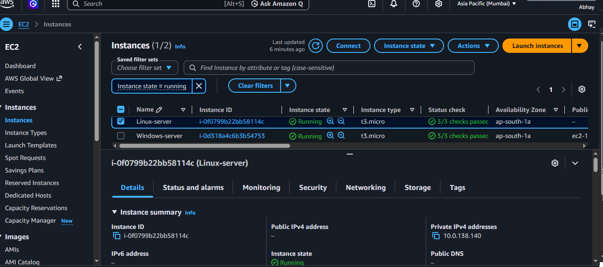
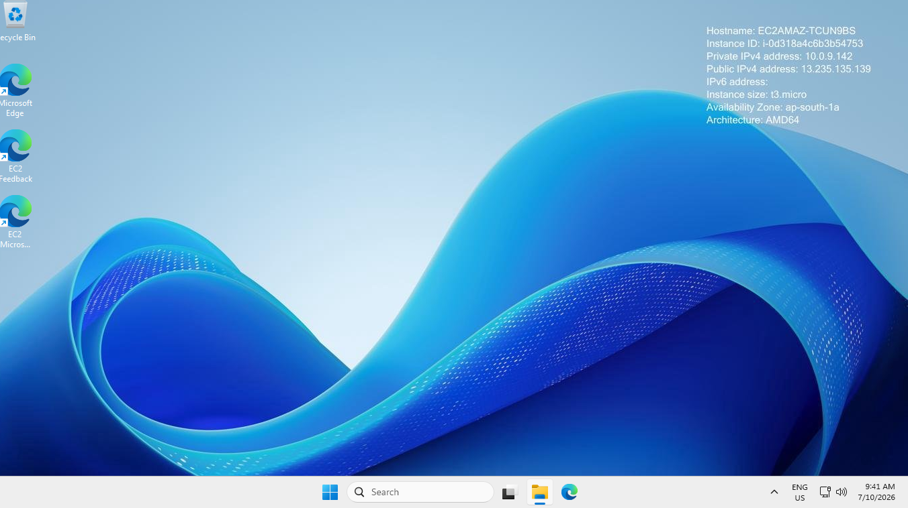
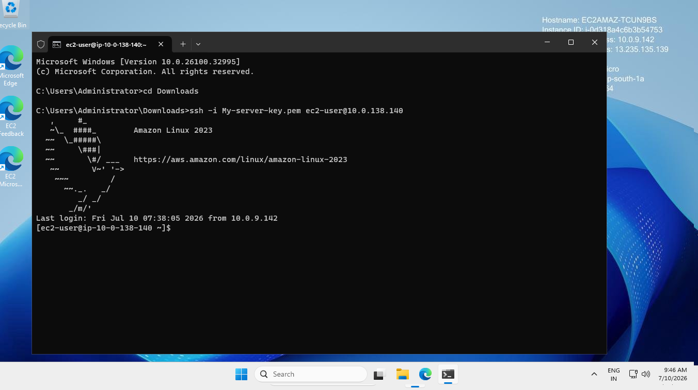
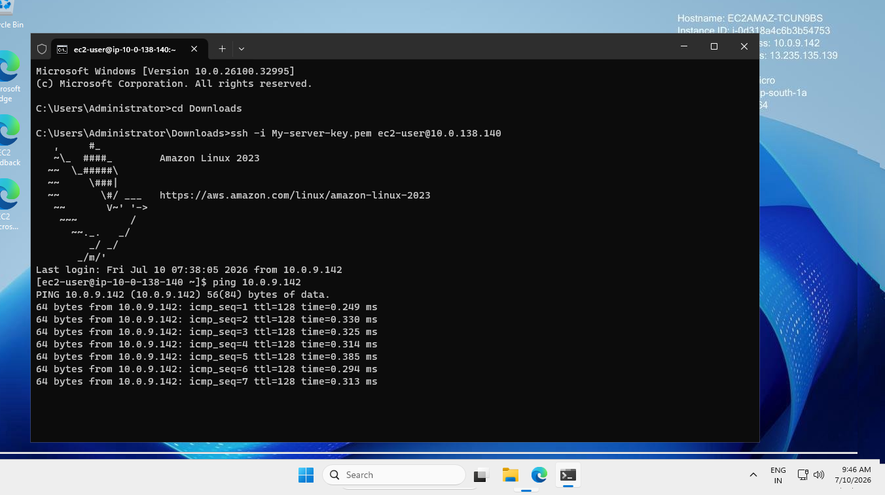
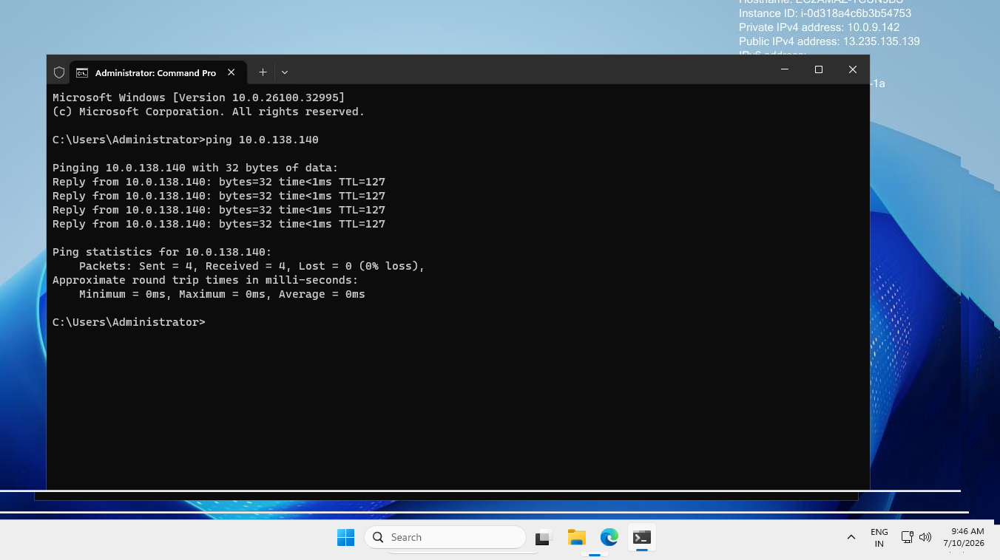

# AWS VPC with Public and Private Subnets

This project demonstrates how to create a Virtual Private Cloud (VPC) using the AWS VPC Wizard. Inside the VPC, one Public Subnet and one Private Subnet are created. A Windows EC2 instance is launched in the Public Subnet, while an Amazon Linux EC2 instance is launched in the Private Subnet. Finally, network connectivity between both instances is verified using ICMP (Ping).

---

# Architecture Diagram



---

# Project Objective

The objective of this project is to understand how networking works in AWS by creating a custom VPC, deploying EC2 instances in different subnets, and verifying communication using private IP addresses.

---

# AWS Services Used

- Amazon VPC
- Amazon EC2
- Internet Gateway
- Route Tables
- Security Groups
- Remote Desktop Protocol (RDP)
- Secure Shell (SSH)

---

# Architecture Overview

| Resource | Details |
|----------|---------|
| VPC | 10.0.0.0/16 |
| Public Subnet | Windows EC2 Instance |
| Private Subnet | Amazon Linux EC2 Instance |
| Internet Gateway | Internet access for Public Subnet |
| Route Tables | Public and Private Routing |
| Security Groups | Control inbound and outbound traffic |

---

# Step 1: Create VPC

A  VPC was created using the AWS VPC Wizard. The wizard automatically created the required networking resources such as Internet Gateway, Route Tables, and Subnets.

### Configuration

- VPC Name : My-VPC
- IPv4 CIDR : 10.0.0.0/16

### Resources Created

- One Public Subnet
- One Private Subnet
- Internet Gateway
- Public Route Table
- Private Route Table

### Screenshot



---

# Step 2: Verify Subnets

The VPC contains two subnets.

### Public Subnet

- Used for internet-facing resources.
- Windows EC2 instance is deployed here.
- Connected to the Internet Gateway through the Public Route Table.

### Private Subnet

- Used for internal resources.
- Amazon Linux EC2 instance is deployed here.
- Does not have a public IP address.

### Screenshot



---

# Step 3: Launch Windows EC2 Instance

A Windows Server instance was launched inside the Public Subnet.

### Configuration

- Operating System : Windows Server 2022
- Public IP : Enabled
- Private IP : Automatically Assigned

### Security Group Rules

| Type | Port | Source |
|------|------|--------|
| RDP | 3389 | My IP |
| ICMP | All | Linux Security Group |

### Purpose

The Windows instance acts as the public machine that can be accessed over the internet using Remote Desktop (RDP).

### Screenshot


---

# Step 4: Launch Linux EC2 Instance

An Amazon Linux 2 instance was launched inside the Private Subnet.

### Configuration

- Operating System : Amazon Linux 2
- Public IP : Disabled
- Private IP : Automatically Assigned

### Security Group Rules

| Type | Port | Source |
|------|------|--------|
| SSH | 22 | Windows Security Group |
| ICMP | All | Windows Security Group |

### Purpose

The Linux instance remains private and can only be accessed from the Windows instance using SSH.

### Screenshot


---
# Step 5: Connect to Windows Server

The Windows EC2 instance was accessed using Remote Desktop Protocol (RDP).

### Purpose

Since the Windows instance is deployed in the Public Subnet, it can be accessed from the internet using its Public IP address.

### Screenshot



---


# Step 6: Connect to Linux Server

The Linux EC2 instance was accessed from the Windows instance using SSH.

### Command

```bash
ssh -i My-server-key.pem ec2-user@<10.0.138.140>
```

### Purpose

The Linux instance does not have a Public IP address. Therefore, it is accessed using its Private IP from another instance inside the same VPC.

### Screenshot



---
# Step 7: Verify Network Connectivity

## Linux to Windows

The Linux instance successfully pinged the Windows instance using its Private IP.

### Command

```cmd
ping <Windows Private IP>
```

### Screenshot



---

# Step 7: Verify Network Connectivity

## Windows to Linux

The Windows instance successfully pinged the Linux instance using its Private IP.

### Command

```cmd
ping <Linux Private IP>
```

### Screenshot



---


