# AWS Secure Web Application Deployment

## Project Overview

This project demonstrates how to securely deploy a web application on AWS using a Bastion Host, Public and Private Subnets.

The infrastructure is designed to meet the following requirements:

- Internet users can access the web application.
- Database server is deployed in a private subnet.
- Administrator can access private instances only through a Bastion Host.
- Private instances can access the internet using a NAT Gateway for software updates.

## AWS Services Used

- Amazon VPC
- Public & Private Subnets
- Internet Gateway
- NAT Gateway
- Route Tables
- Security Groups
- Amazon EC2
- Elastic IP

- ## Architecture Diagram

The following architecture shows the complete network design of the project. The web server is deployed in the public subnet, while the database server is deployed in the private subnet. Administrative access is provided through a Bastion Host, and private instances access the internet through a NAT Gateway.

[Architecture Diagram](images/architecture.png)

# Step 1: Create a Virtual Private Cloud (VPC)

The first step was to create a Virtual Private Cloud (VPC) with the CIDR block **10.0.0.0/16**. The VPC provides an isolated networking environment where all AWS resources are deployed securely.

**Purpose:**
- Provides network isolation.
- Allows creation of public and private subnets.
- Enables secure communication between AWS resources.

  [VPC](images/VPC.png)

  ---

# Step 2: Create Public and Private Subnets

After creating the VPC, two subnets were created to separate public-facing resources from internal resources.

### Public Subnet
- CIDR Block: **10.0.1.0/24**
- Used for:
  - Bastion Host
  - Web Server
  - NAT Gateway

### Private Subnet
- CIDR Block: **10.0.2.0/25**
- Used for:
  - Database Server

This design improves security by ensuring that sensitive resources remain inaccessible from the public internet.

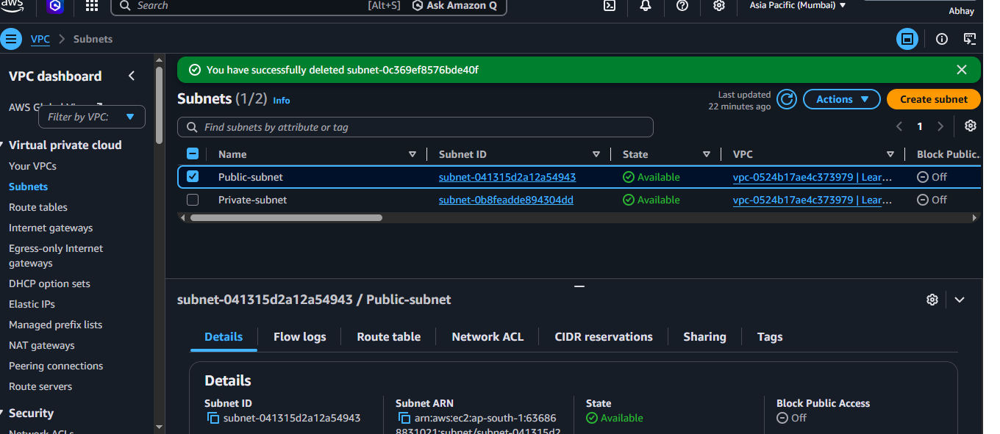

---

# Step 3: Attach an Internet Gateway

An Internet Gateway (IGW) was attached to the VPC to provide internet connectivity for resources deployed in the public subnet.

Without an Internet Gateway, the web server cannot receive requests from internet users.

### Result
- Public Subnet can communicate with the Internet.
- Web Server becomes accessible through its Public IP.

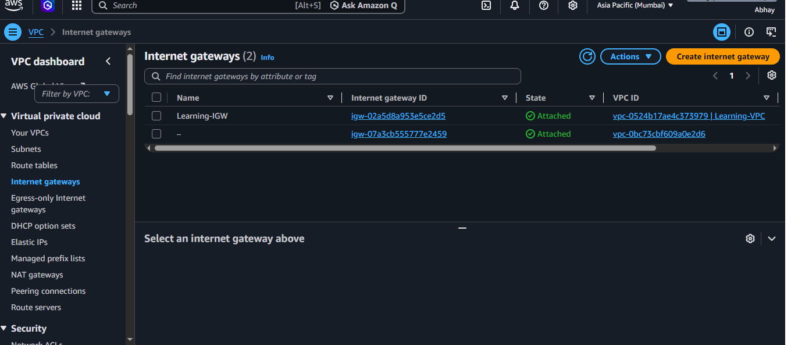

---

# Step 5: Configure Route Tables

Two Route Tables were configured.

### Public Route Table

- Connected to Internet Gateway
- Associated with Public Subnet

### Private Route Table

- Connected to NAT Gateway
- Associated with Private Subnet

This routing configuration ensures that only public resources receive direct internet access while private resources access the internet securely through the NAT Gateway.

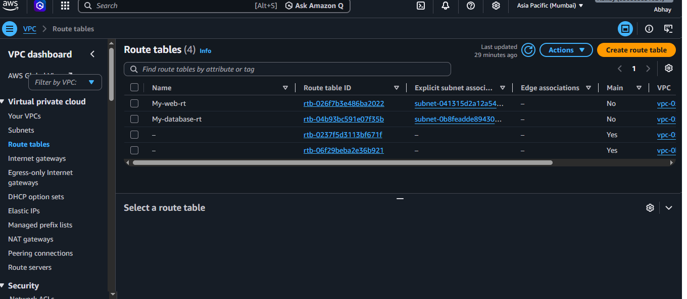

---

# Step 4: Create NAT Gateway

A NAT Gateway was deployed in the Public Subnet with an Elastic IP.

The NAT Gateway allows instances inside the Private Subnet to access the internet for software updates without exposing them to inbound internet traffic.

### Benefits

- Secure outbound internet access
- No inbound internet connection
- Required for software updates


---

# Step 6: Launch Bastion Host

A Bastion Host was launched in the **Public Subnet** to provide secure SSH access to instances located in the Private Subnet.

The Bastion Host acts as a secure jump server, ensuring that private instances are never directly exposed to the internet.

### Configuration

- Public Subnet
- Public IP Enabled
- SSH (Port 22) allowed only from my IP address

### Result

Administrators can securely access private resources through the Bastion Host.

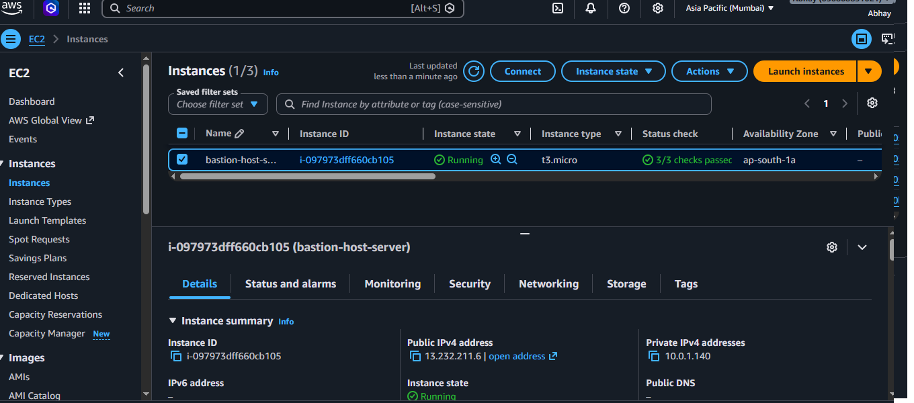

---

# Step 7: Launch Web Server

An EC2 instance was launched in the **Public Subnet** to host the web application.

The web server is accessible through its Public IP and serves HTTP requests from internet users.

### Configuration

- Public Subnet
- Public IP Enabled
- HTTP (80)
- HTTPS (443)

### Result

Users can access the deployed web application through a web browser.

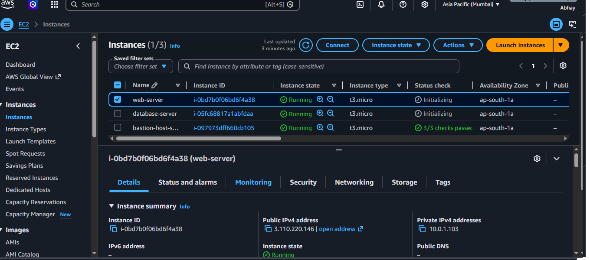

---

# Step 8: Launch Database Server

A database server was deployed inside the **Private Subnet** to securely store application data.

The instance does not have a Public IP, preventing direct internet access.

### Configuration

- Private Subnet
- No Public IP
- Accessible only from the Web Server

### Result

The database remains protected from external users while allowing secure communication with the application.

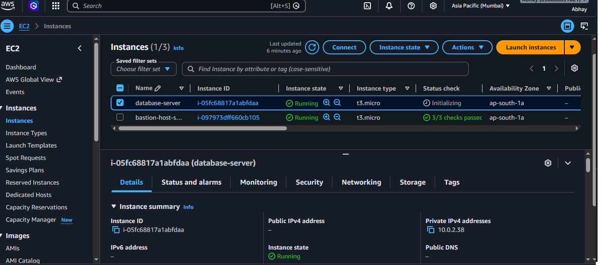

---

# Step 9: Configure Security Groups

Security Groups were configured to control inbound and outbound traffic for each instance.

| Instance | Allowed Access |
|----------|----------------|
| Bastion Host | SSH (22) from My IP |
| Web Server | HTTP (80), HTTPS (443), SSH from Bastion Host |
| Database Server | MySQL (3306) from Web Server |

This configuration ensures that only authorized resources can communicate with each other.

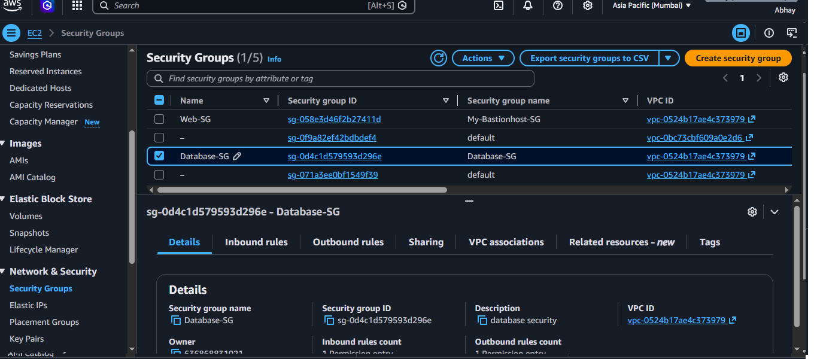

---

# Step 10: Access the Bastion Host

The Bastion Host was launched in the **Public Subnet** with a Public IP address. It acts as a secure jump server for accessing instances located in the Private Subnet.

The administrator connected to the Bastion Host using SSH and the downloaded key pair.

### SSH Command

```bash
ssh -i "My-server-key.pem" ec2-user@<Bastion-Public-IP>
```

### Result

- Successfully connected to the Bastion Host.
- Secure administrative access established.
- Ready to connect to private instances.

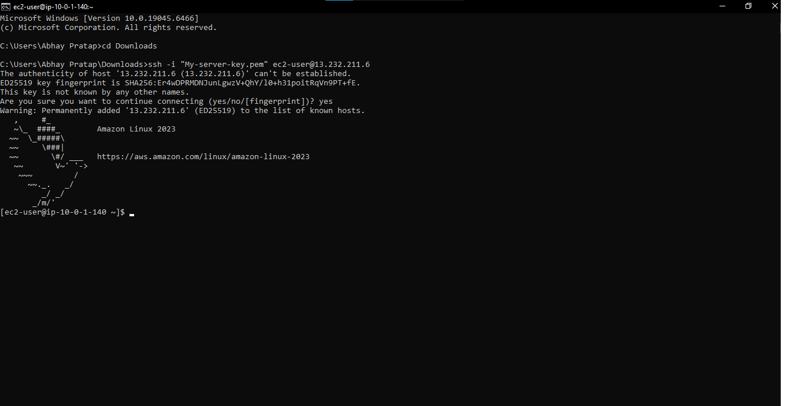


# Step 11: Copy the Private Key to the Bastion Host

To access the private EC2 instance, the SSH private key was securely copied from the local machine to the Bastion Host using the **Secure Copy Protocol (SCP)**.

This key is required because the Bastion Host must authenticate with the private EC2 instance before establishing an SSH connection.

## SCP Command

```bash
scp -i "My-server-key.pem" "My-server-key.pem" ec2-user@13.232.211.6:~

Before using the key for SSH authentication, the file permissions were restricted.

```bash
chmod 400 My-server-key.pem
```

## Result

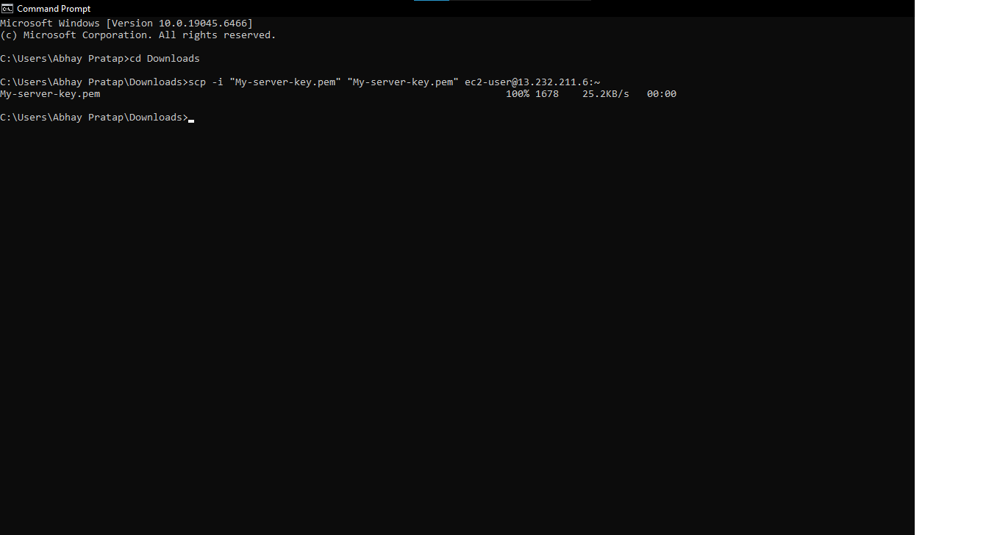

---

# Step 12: Access the Private EC2 Instance from the Bastion Host

After copying the SSH private key to the Bastion Host, I established an SSH connection from the Bastion Host to the Private EC2 instance using its **Private IP Address**.

Since the Private EC2 instance does not have a Public IP address, it cannot be accessed directly from the internet. The Bastion Host acts as a secure jump server, allowing administrators to securely reach private resources inside the VPC.

## SSH Command

```bash
ssh -i My-server-key.pem ec2-user@10.0.2.38
```

## Result

- Successfully connected to the Private EC2 instance.
- Verified that the instance is reachable only through the Bastion Host.
- Confirmed secure SSH access without exposing the Private EC2 instance to the public internet.

## Output

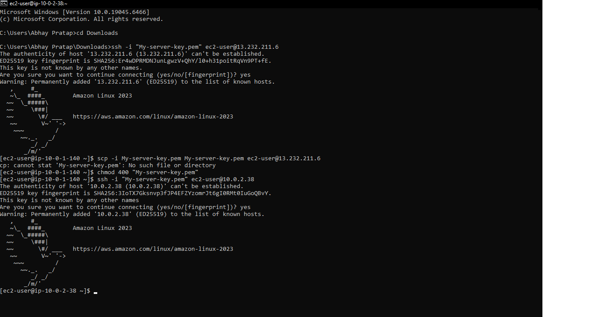

---

# Step 9: Verify Internet Access from the Private EC2 Instance

After successfully connecting to the Private EC2 instance through the Bastion Host, internet connectivity was verified.

Although the Private EC2 instance does not have a Public IP address, it can still access the internet through the **NAT Gateway**. This allows the instance to download software updates and install required packages while remaining inaccessible from the public internet.

## Verification Commands

```bash
- ping 8.8.8.8
```

## Result

- Successfully downloaded packages from the internet.
- Confirmed that outbound internet access is working through the NAT Gateway.
- Verified that the Private EC2 instance remains secure without a Public IP address.

## Output

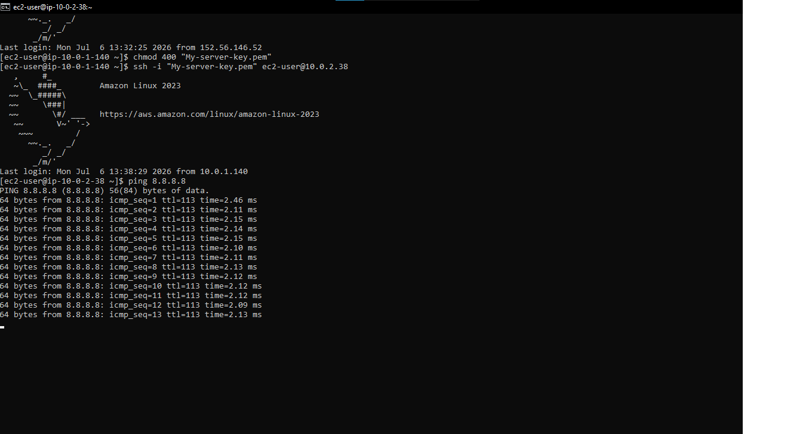)

- Successfully copied the private key to the Bastion Host.
- Verified that the key file exists.
- Updated file permissions to ensure secure SSH authentication.
- The Bastion Host is now ready to connect to the private EC2 instance.


